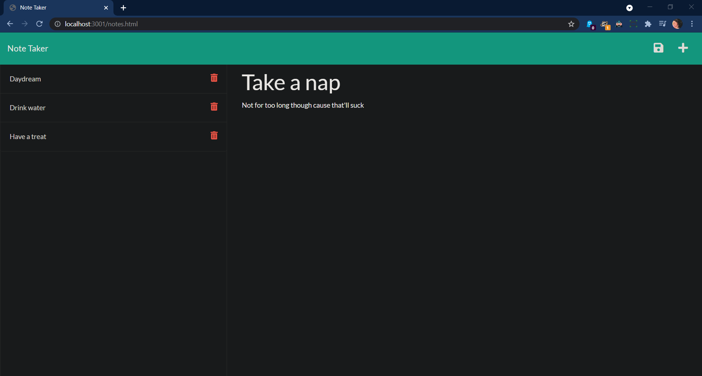

# 11 Express.js: Note Taker

 

# Title: Note Taker using Express.js

## Table of Contents:

- [Description](#description)
- [Heroku link and walkthrough video](#link)
- [Installation](#installation)
- [Usage](#usage)
- [Contact](#contact)

## Description:

This application generates a webpage displaying employee profiles based on user input

## Link:

https://pure-tor-58959.herokuapp.com/

https://www.dropbox.com/s/pvcyukvnseqvodf/11-NoteTaker.mp4?dl=0

## Installation:

Must install node.js, express and use heroku to deploy.

## Usage:

From the terminal, run node app/index.js (or npm start). Then from a browser, go to localhost:3001, this will take you to the index.html page. From there click on "Get Started" to add notes.

## Contact:

Email: tatybcoding@gmail.com

Github: MehaletKB
